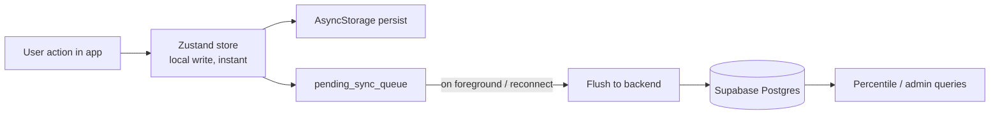

# EVATS Mobile — Architecture & Improvement Plan

**For:** Any engineer or coding agent picking up `evats-mobile-poc`
**Status:** Phase 1 complete, Phase 2 partial (per README roadmap)
**Purpose:** Sequenced, actionable plan to move this from POC to a trustworthy training product. Work top to bottom — later phases assume earlier ones are done.

---

## 0. How to Use This Document

1. **Don't skip P0.** Everything below it assumes scoring integrity and platform stability are real, not stubbed.
2. Each task has a **Definition of Done (DoD)**. A task is not complete when it compiles — it's complete when the DoD is true.
3. Where this doc references a file path, it's inferred from the README's documented directory structure, not from reading the actual source. **Verify the path exists before editing; if it's moved, find the equivalent file and proceed.**
4. If a task requires a product decision (not a technical one), it's flagged `⚠ DECISION NEEDED` — surface it back to the person rather than assuming.
5. Check off `- [ ]` items as completed if this file is kept in-repo as a living tracker.

---

## 1. Current State (context)

- React Native + Expo (SDK 54), TypeScript strict, Expo Router, Zustand, AsyncStorage persistence.
- 3D bus model rendered via `react-native-webview` + Three.js (not native R3F).
- 8-module architecture with a prerequisite chain (`hv-power → lv-power → can-bus → hv-aux → regen-braking → propulsion → overall-power → pneumatic`), only `hv-power` has real content.
- Four minigame types: MCQ (real), MAQ (real), Connector (**stubbed — auto-marks correct**), Rank Order (**stubbed — auto-marks correct**).
- No backend yet — all state is local (AsyncStorage via Zustand persist middleware). Percentile is a static mock.
- Video playback, flowchart rendering, and certificate export are all placeholder/alert-only.

---

## 2. Priority Map

| Tier | Theme | Why this order |
|---|---|---|
| **P0** | Integrity fixes | Anything scored or shipped today is either fake or on a deprecated dependency. Fix before building more on top. |
| **P1** | Foundational architecture | Backend, offline sync, content schema, telemetry — the load-bearing walls everything else depends on. |
| **P2** | Core delivery gaps | Real content, real flowchart rendering, real video. This *is* the product. |
| **P3** | New engagement features | Only worth building once P0–P2 are solid — new minigames on a shaky foundation just compounds technical debt. |

---

## 3. P0 — Integrity Fixes (Do First, No Exceptions)

### P0.1 — Real scoring for Connector & Rank Order games

**Problem:** These two game types currently auto-mark every submission as correct. That means XP, streaks, grade, and percentile are all partially fabricated today.

**Steps:**
1. Locate the submission handler for each game — likely inside `src/components/quiz/ConnectorGame.tsx` and `src/components/quiz/RankOrderGame.tsx`, or wherever `app/games/[moduleId].tsx` receives the result callback.
2. Define an answer key per question in `src/data/moduleRegistry.ts` (or a sibling data file) — for Connector: a map of `{ itemId: correctTargetId }`; for Rank Order: a canonical ordered array of step IDs.
3. Replace the stubbed "always correct" branch with real comparison logic:
   - **Connector:** score = (number of correct pairings) / (total pairings). Decide `⚠ DECISION NEEDED`: partial credit per pairing, or all-or-nothing per question?
   - **Rank Order:** compare submitted order to canonical order. Recommend **exact match only** (not partial-credit distance scoring) — for procedural/safety training, "close" ordering isn't meaningfully safer, so don't reward it.
4. Wire the real score into whatever `useProgressStore.ts` currently receives from the stubbed path.
5. Add a unit test per game type: one fully-correct submission, one fully-wrong, one partial (if partial credit is chosen).

**DoD:** Submitting a deliberately wrong Connector/Rank Order answer produces a lower score than a correct one, and this is covered by a test — not just visually verified once.

---

### P0.2 — Migrate off `expo-av`

**Problem:** `expo-av` was deprecated as of SDK 53, SDK 54 (current) is its last supported release, and it is fully removed in SDK 55. The app's Media layer (`expo-av`) will not survive the next SDK upgrade unchanged.

**Steps:**
1. `npx expo install expo-video expo-audio`
2. Replace any `<Video>` component usage with the new split API: a `useVideoPlayer(source)` hook for playback control + a `<VideoView player={player} />` for rendering — this is an architectural split (logic vs. view), not a drop-in rename, so expect to touch component structure, not just imports.
3. Replace any `Audio.Sound` usage with `useAudioPlayer`, and any `Audio.Recording` usage with `useAudioRecorder`.
4. Remove `expo-av` from `package.json` once all usages are migrated — don't leave it installed "just in case."
5. Run `npx expo-doctor` to catch any remaining dependency mismatches.

**DoD:** `expo-av` does not appear in `package.json`; video/audio playback works identically to before on both platforms.

---

### P0.3 — Confirm New Architecture is enabled and stable

**Problem:** SDK 54 is the last release supporting Legacy Architecture — SDK 55 makes New Architecture mandatory. `react-native-reanimated` v4 (already in the stack) requires New Architecture to begin with, so this may already be forced on; verify rather than assume.

**Steps:**
1. Check `app.json`/`app.config.ts` for `newArchEnabled` (or confirm the project template already defaults to it, since SDK 54's default template does).
2. Run the app on both a physical Android device and iOS device — not just simulators — and exercise the 3D WebView screen, Reanimated-driven animations, and gesture-handler interactions specifically, since these are the libraries most sensitive to architecture mode.
3. Document the confirmed state in the README's tech stack table so the next person isn't guessing.

**DoD:** New Architecture status is explicitly known and tested, not implicit.

---

## 4. P1 — Foundational Architecture

### P1.1 — Backend MVP (not the full admin platform yet)

**Problem:** Everything currently lives in local AsyncStorage. There is no way to compute a real percentile, no way for an admin to see cohort progress, and a reinstalled app loses all history.

**Scope for MVP only** (defer dashboard/QR-cert/leaderboard to P3+):

Starting schema (Supabase or Firebase — either works; Supabase's Postgres + Row Level Security is a reasonable default if no strong preference exists):

```
users             (id, auth_uid, role, employee_id, created_at)
module_progress   (user_id, module_id, status, unlocked_at, completed_at)
quiz_attempts     (id, user_id, module_id, score, percentage, grade, taken_at)
game_attempts     (id, user_id, module_id, game_type, score, taken_at)
streaks           (user_id, current_streak, longest_streak, last_active_date)
```

**Steps:**
1. Stand up Supabase project, define the tables above with Row Level Security so a user can only read/write their own rows.
2. Add an auth flow (Supabase Auth — email/OTP or SSO depending on company IT setup — `⚠ DECISION NEEDED`).
3. On every local write to `useProgressStore.ts`, also push the equivalent row remotely (see P1.2 for the offline-safe version of this).
4. Replace the mocked percentile calculation with a real query: `percentile = 1 - (rank of this score / total attempts for this module)`.

**DoD:** A quiz/game result taken on Device A is visible in the backend and would survive an app reinstall.

---

### P1.2 — Offline-first sync layer

**Problem:** Field service technicians and trainees may be training in workshops/bus bays with unreliable connectivity. A hard dependency on network for every write will break the app mid-session.

**Steps:**
1. Keep local Zustand + AsyncStorage as the source of truth for the UI (writes should never block on network).
2. Add a `pending_sync_queue` array to the persisted store: every mutation gets appended here with a client-generated UUID + timestamp before (not instead of) being applied locally.
3. On app foreground and on network-reconnect (via `@react-native-community/netinfo` or Expo's `Network` module), flush the queue to the backend in order, removing entries on success.
4. Conflict resolution per table — keep it simple:
   - `quiz_attempts` / `game_attempts`: append-only, no conflicts possible.
   - `streaks`: highest value wins.
   - `module_progress`: latest timestamp wins.

**DoD:** Airplane-mode test — complete a quiz offline, reconnect, confirm the result appears server-side without duplication or loss.

---

### P1.3 — Content schema & versioning

**Problem:** Only `hv-power` is populated, and content currently lives hardcoded inside TypeScript data files (`hvSystemData.ts`, `flowchartData.ts`, `quizQuestions.ts`). That means adding the remaining 7 modules requires a developer to hand-write TS, and there's no way to review/version content independently of code.

**Steps:**
1. Define a JSON schema for a module's content, independent of any TS types used to render it:
   ```json
   {
     "moduleId": "lv-power",
     "title": "LV Power System",
     "prerequisite": "hv-power",
     "components": [
       { "id": "dc-dc-converter", "name": "DC-DC Converter", "description": "...", "imageRef": "assets/images/dc-dc.png" }
     ],
     "flowchartRef": "assets/flowcharts/lv-power.svg",
     "quizQuestions": [
       { "id": "lv-001", "type": "mcq", "difficulty": "easy", "prompt": "...", "options": ["..."], "answer": 0 }
     ]
   }
   ```
2. Write a small validation script (JSON Schema + `ajv`, or a Zod schema if staying in the TS ecosystem) that runs in CI against every module content file — catches malformed content before it ships.
3. Migrate `hv-power`'s existing data into this schema as the reference implementation — this also proves the schema is sufficient before you use it for 7 more modules.
4. Point `moduleRegistry.ts` at the schema-validated content files instead of hand-authored TS objects.

**DoD:** A non-engineer (or an agent) could add a new module by authoring one JSON file and passing schema validation — no TS changes required.

---

### P1.4 — Analytics / telemetry instrumentation

**Problem:** The original ask for this mobile port was DAU tracking and engagement measurement — but nothing currently captures that beyond final scores.

**Steps:**
1. Add a `telemetry_events` table (or equivalent) — `event_name, user_id, module_id, metadata (jsonb), client_ts`.
2. Instrument, at minimum: `module_opened`, `quiz_started`, `quiz_completed`, `game_completed`, `streak_incremented`, `streak_broken`, `certificate_generated`.
3. Route these through the same offline-safe queue from P1.2 — telemetry shouldn't require a live connection either.
4. If usage grows past what raw SQL queries comfortably answer, layer a proper product-analytics tool (e.g., PostHog) on top later — don't over-build this now.

**DoD:** An admin could answer "which module has the highest drop-off" from data, not from guessing.

---

## 5. P2 — Core Delivery Gaps & Re-sequencing

### P2.1 — Populate LV Power + CAN Bus modules

Using the P1.3 schema, author full content (components, flowchart SVG, quiz bank) for the next two modules in the prerequisite chain. This turns a 1-module demo into a 3-module pilot — the minimum viable thing an admin could actually run with a cohort of trainees.

**DoD:** Three modules (`hv-power`, `lv-power`, `can-bus`) are fully playable end-to-end: learn → games → quiz → results.

---

### P2.2 — Real flowchart viewer

**Problem:** Currently shows a component list instead of the SVG flowchart — a significant gap for a tool whose stated purpose is "training visualization."

**Steps:**
1. Use `react-native-svg` to render the existing SVG assets in `assets/flowcharts/` directly (simpler than adopting `react-native-skia`, since you already have authored SVGs rather than needing custom canvas drawing).
2. Wrap in `react-native-gesture-handler` + `react-native-reanimated` (already in the stack) for pinch-to-zoom and pan.
3. Add tap-to-highlight: tapping a node in the SVG surfaces the matching component's detail card from `moduleRegistry.ts`.

**DoD:** Opening a module's flowchart shows the actual diagram, zoomable and tappable — not a text list.

---

### P2.3 — Streaming video (replace bundled `require()`)

**Problem:** Bundling training videos via `require()` will bloat the app binary significantly as more modules get videos — a real risk for install size and OTA update size.

**Steps:**
1. Host videos on a CDN or object storage (Supabase Storage, S3+CloudFront, etc.).
2. Use the `expo-video` migration from P0.2 — point `useVideoPlayer` at the remote URL instead of a local asset.
3. Stretch: adopt HLS adaptive streaming if field connectivity is inconsistent (ties into the offline/connectivity question in Section 9).

**DoD:** Videos stream from a URL; the app binary size no longer grows per module added.

---

### P2.4 — Content QA pass

**Problem:** No stated review step exists between "content authored" and "content shipped." For HV/safety-adjacent systems, a wrong "correct answer" is a real training risk, not just a bug.

**Steps:**
1. Add a lightweight sign-off step (even a shared spreadsheet or a PR review checklist) requiring a subject-matter-expert pass on every new module's quiz answer key before merge.

**DoD:** Every shipped module's content has a recorded reviewer, not just an author.

---

## 6. P3 — New Minigames & Engagement Features

Only start this section once P0–P2 are done. Ordered by recommended priority, not by ease of implementation.

| Feature | Mechanic | New data needed | Complexity | Depends on |
|---|---|---|---|---|
| **Diagnose-the-bus** (already on roadmap — promote it) | Branching fault scenario: symptom → diagnostic choices → outcome | Decision-tree content per module (new schema extension) | L | P1.3 schema |
| **Build-the-circuit** | Extend Connector game: wire multiple components into a mini schematic in order, timed | Reuses P0.1's answer-key pattern | M | P0.1 |
| **Expected-reading estimator** | Given a schematic + test point, input expected voltage/current within tolerance | Tolerance ranges per test point | M | P1.3 schema |
| **Fault-ticket triage (timed)** | Symptom list → pick likely faulty component under countdown | Reuses MCQ engine | S | none |
| **Head-to-head battle mode** | Same question set, live, two trainees, faster-correct wins | Realtime channel (Supabase Realtime) | M | P1.1 backend |
| **Daily spot-the-fault** | One deliberately-wrong connection in a diagram, tap-to-flag, single daily attempt | Reuses P2.2 SVG viewer | S | P2.2 |
| **Final boss (Day 9)** | Re-skin the existing master eval as a distinct capstone event, mixed question types across all modules | None — presentation layer only | S | P2.1 (multi-module content) |

---

## 7. Suggested Execution Sequence

1. **Sprint 1:** P0.1, P0.2, P0.3 — integrity and platform debt. Nothing else starts until this is done.
2. **Sprint 2:** P1.1 (backend MVP) + begin P1.3 (content schema design).
3. **Sprint 3:** P1.2 (offline sync) + finish P1.3, migrate `hv-power` into the new schema.
4. **Sprint 4:** P2.1 (populate LV Power + CAN Bus) in parallel with P2.2 (flowchart viewer).
5. **Sprint 5:** P2.3 (video streaming), P2.4 (QA process), P1.4 (telemetry).
6. **Sprint 6+:** P3 features, starting with Diagnose-the-bus.

---

## 8. Master Definition-of-Done Checklist

- [ ] Connector & Rank Order games score real answers, not auto-correct
- [ ] `expo-av` fully removed, replaced with `expo-video`/`expo-audio`
- [ ] New Architecture status confirmed and tested on physical devices
- [ ] Backend MVP live; quiz/game results persist server-side
- [ ] Offline queue tested (airplane-mode round trip)
- [ ] Content schema defined, validated in CI, `hv-power` migrated to it
- [ ] Telemetry events flowing for module/quiz/game/streak lifecycle
- [ ] 3 modules fully populated and playable end-to-end
- [ ] Flowchart viewer renders real SVGs with zoom + tap-to-highlight
- [ ] Video streams from remote URL, not bundled
- [ ] Content QA sign-off process exists and has been used at least once
- [ ] Real percentile calculation replaces the mock

---

## 9. Open Questions (surface to stakeholders, don't assume)

- ⚠ Connectivity: is this used in areas with reliable Wi-Fi, or workshop/bus-bay environments with weak signal? This determines how aggressively P1.2/P2.3 need to lean offline-first.
- ⚠ Auth method: company SSO, or simple email/employee-ID login?
- ⚠ Partial credit policy for Connector/Rank Order games (P0.1) — all-or-nothing vs. proportional scoring.
- ⚠ Data retention: how long should individual trainee performance data be kept, and who besides the requesting admin manager can see it?
- ⚠ Is a native (non-Expo-Go) development build already in use, or still running purely through Expo Go? This affects whether some of the above (offline background sync, native video caching) are fully available.

---

## 10. Command Reference

```bash
# Migrate video/audio
npx expo install expo-video expo-audio
npx expo-doctor

# Typecheck after any refactor
npx tsc --noEmit

# Clear cache when things get weird after dependency changes
npx expo start --clear
```

---

### Target sync architecture (P1.1 + P1.2)


